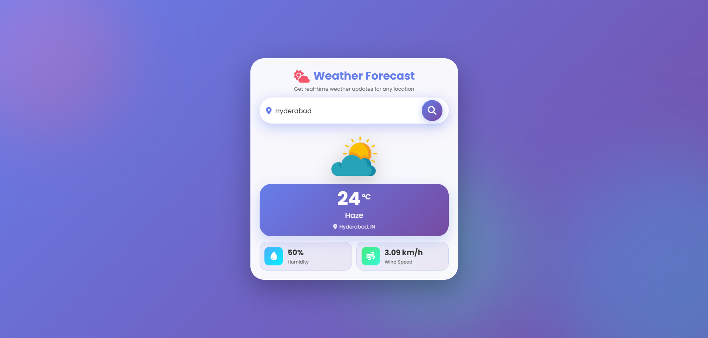

# 🌦️ Weather Application

## 📌 Overview

A clean and responsive weather application that provides real-time weather information for any city worldwide. It fetches live data from a weather API and presents current conditions such as temperature, humidity, wind speed, and weather status in an intuitive, user-friendly interface.

---

## 🎯 Objectives

* Allow users to search and view real-time weather data for any location.

* Display essential weather parameters clearly and accurately.

* Provide a responsive UI that works smoothly across devices.

* Handle invalid city searches gracefully with proper feedback.

* Keep the application lightweight and easy to deploy.

---

## 🛠️ Tech Stack Used

| Layer / Component | Technologies Used       | Description                                                           |
| ----------------- | ----------------------- | --------------------------------------------------------------------- |
| **UI Markup**     | HTML5                   | Structure for search input, weather cards, and data display.          |
| **Styling**       | CSS3                    | Responsive layout, weather cards, icons alignment, and visual polish. |
| **Logic**         | JavaScript (Vanilla JS) | API calls, data parsing, DOM updates, and error handling.             |
| **API**           | OpenWeatherMap API      | Fetches real-time weather data based on city name.                    |

---

## 🗂️ Project Structure

```
Weather-Application/
├── index.html 
├── style.css 
├── script.js
├── api
    └── weather.js
├── assets/ (all the images required)
└── README.md
```

---

## 🖥️ Application Preview

Key Features

- City-based weather search

- Real-time temperature and weather condition display

- Humidity and wind speed indicators

- Dynamic weather icons based on conditions

### Preview


---

## 🌐 Demonstration

You can run the application locally by opening index.html in your browser.
The application is deployed and can be checked here:

[🔗 View Live Site](https://weather-application-three-murex.vercel.app/)

---

## ⚙️ Application Behavior

* Search: Users enter a city name to fetch live weather data.

* API Handling: JavaScript fetches data asynchronously from the weather API.

* Error Feedback: Displays an error message for invalid or empty city names.

* UI Update: Weather details update dynamically without page reload.

---

